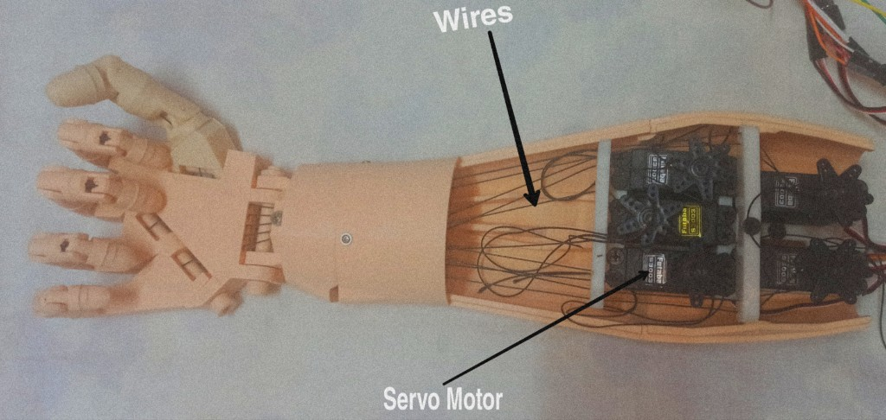

# BFCAI - Graduaton Project - Medical Informatics Department.
## Project Name
Identifying and Controlling Hand Gestures on 3D Prosthetic Hand Using EMG Signals
## Project Objective
The aim of this project is to build and design a prosthetic or bionic hand using 3D printing techniques that simulate the natural hand almost in its movement, size, and dimensions.
## Programming Languages & Libraries & Environments
- C++
- Python
- Tensorflow & Keras
- Pyqt5
- Scipy
- Google Colab
- VS Code
## Hardware Components
- Arduino Uno R3
- EMG Muscles Sensors 
- Servo motors S3003
- 3D Hand Parts 
## Dataset 
Our dataset is collected from group of people using EMG muscle sensor V3 it consists of one channel so we had been recorded three hand movements to capture the data using Arduino board.
## Software Implementation 
- we decided to develop a novel convolution network using keras from tensorflow for recognize hand gestures directly from raw EMG signals. The proposed CNN is newfangled because it doesn’t require any preprocessing techniques or spectrograms. 
- we used 1D convolution layers instead of Conv2D.
- we have used collected dataset from our volunteers and used it to train the model. the proposed network consists of 5 convolution layers, BatchNormalization, and 3 max pooling layers. 
- The input of network is recorded raw EMG data about 232619 samples with 3 labels, the traning set is 93047 sample and validation set is about 93048, all these samples are reshaped into 1 dimensional array to feed it to convolutional layers. The output of the network is integer number of class label corresponded to its gesture name which is one of the three class labels we have used (0 for resting state, 1 for holding state, 2 for closing state)
## Hardware Implementation
- The hardware of our system is consisting of one microcontroller which is Arduino-uno-r3, EMG muscle sensor with 9V output power the minimum low voltage is ±3.4, also we have used 5 servo motors type of futaba s3003 these servos work on 9V power and 2A for current. Data acquisition process is done by placing electrodes on the hand 
two of them is placed on the interest muscles and the third one is placed on the non-active region. 
- The five servos connected to breadboards respectively with hand fingers the positive pin is connected to 6-volt AC adapter and the negative is connected to GND of Arduino board, these servos is rested in forearm of 3D bionic hand. 
- The 3D parts is obtained from InMoov is a humanoid robot, constructed out of 3D printable plastic body components, and controlled by Arduino microcontrollers 

